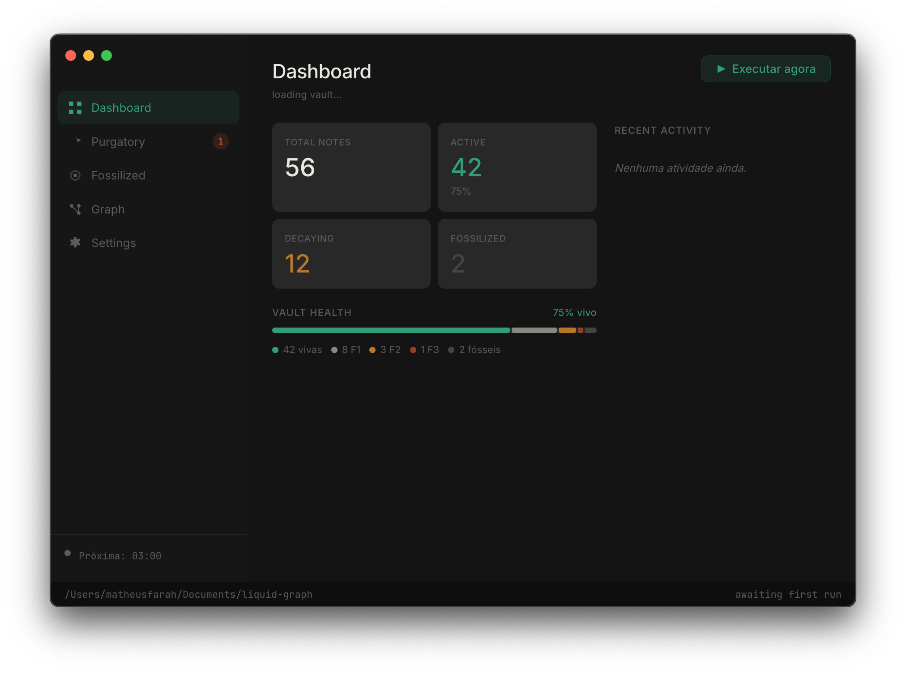
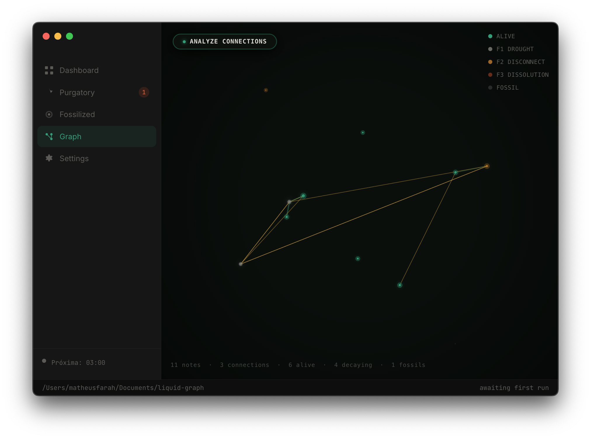
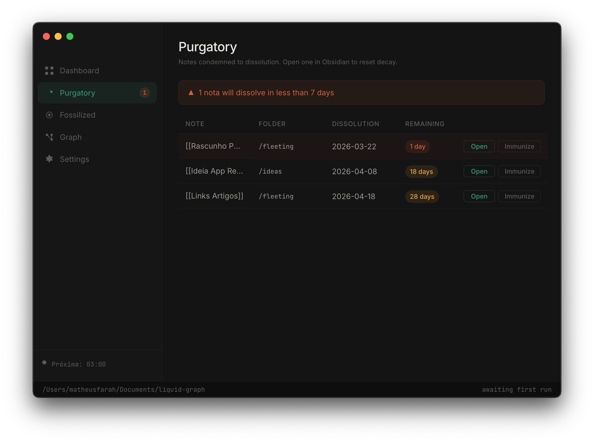

# Atropos

**A semantic garbage collector for Obsidian vaults.**

Atropos is a local desktop daemon that applies programmed entropy to Markdown files based on inactivity. Notes that are not revisited or connected progressively lose visibility in the graph, get disconnected from the knowledge network, and are eventually compressed by AI into a single archival sentence — while the original is always preserved.

The system runs silently in the background, executing once per day during off-hours. No cloud sync. No subscriptions. No data ever leaves your machine except for the AI compression call you explicitly configure.

<p align="center">
  
  
</p>

<p align="center">
  
</p>

---

## The Problem

Knowledge management tools are optimized for capture, not for forgetting. Over time, a vault accumulates hundreds of notes that are never revisited — half-formed ideas, outdated meeting notes, obsolete drafts. They consume cognitive space in the graph without contributing meaning. There is no native mechanism in Obsidian to let knowledge decay naturally.

Atropos is that mechanism.

---

## How It Works

The system evaluates each note's vitality based on the time elapsed since its last modification. Decay happens in three sequential phases:

### Phase 1 — Drought (inactivity > 30 days)

The note is flagged as inactive. No content is modified. The system injects `decay_level: 1` into the YAML frontmatter. In Obsidian, the graph node loses its primary color and turns gray through pre-configured graph filters.

### Phase 2 — Disconnection (inactivity > 60 days)

Before any modification, the system creates a mandatory Git snapshot of the entire vault. Then it scans every `.md` file in the vault, finds all references to the decaying note, and replaces `[[Note Name]]` wikilink syntax with plain text. The note loses all its edges in the graph, becoming an isolated node — an island disconnected from the main knowledge network.

### Phase 3 — Dissolution (inactivity > 90 days)

The note's content is sent to an AI provider (Google Gemini or Anthropic Claude) for lossy compression. The original file is moved to `/_fossilized/YYYY-MM/` and a lightweight note is created in its place containing a one-sentence summary and a recovery link. The original is never deleted.

**Resurrection:** linking to a decaying note from any other note resets its `decay_level` to zero on the next execution cycle.

---

## Features

### Dashboard

Real-time vault health overview. Displays total note count, active notes, notes in decay across all three phases, fossilized count, and a visual health bar showing the distribution of vault states. Recent activity log shows the last execution results inline.

### Interactive Graph

A live D3.js force simulation of your entire vault. Nodes are colored by decay phase — teal for active, gray for Phase 1, amber for Phase 2, coral for Phase 3, dark for fossilized. Nodes that have lost their wikilinks drift naturally toward the periphery. Hover any node to see its name and decay state. Click to open the note directly in Obsidian.

### Semantic Connections (Ollama)

Optional local AI layer using [Ollama](https://ollama.com) and the `nomic-embed-text` embedding model. When enabled, Atropos computes cosine similarity between all notes and surfaces thematic connections as dashed amber edges in the graph — distinct from real wikilinks. Runs entirely offline. No data leaves the machine. Results are cached to avoid recomputing unchanged notes.

### Purgatory

A list of all notes scheduled for Phase 3 within the next 30 days, sorted by urgency. Divided into two sections: notes expiring within 7 days, and notes expiring within the month. Each entry shows the note name, folder, dissolution date, and days remaining. Every note can be opened in Obsidian or immunized directly from the interface.

### Fossilized Archive

Browse all notes that have completed Phase 3. Each card shows the original note name, the date it was fossilized, and the one-sentence AI summary generated at compression time. Original files are recoverable from `/_fossilized/YYYY-MM/` with a single click.

### Cross-Device Sync

Git-based synchronization between devices. Atropos pulls remote changes before each execution cycle and pushes the updated vault state after completion. Conflicts are resolved automatically using last-write-wins based on file modification timestamps. Requires a Git remote — a private GitHub repository is recommended.

### System Tray

Atropos runs in the background via the system tray. The main window can be closed without stopping the daemon. The tray menu shows the next scheduled execution time and provides quick access to run immediately, open the dashboard, or quit.

---

## Architecture

Atropos is a single local component — a Node.js daemon packaged as an Electron desktop application. There is no external server, no orchestrator, no cloud dependency. The AI API call in Phase 3 goes directly from your machine to Google or Anthropic.

```
atropos/
├── electron/
│   ├── main.js              — BrowserWindow, system tray, scheduler
│   ├── preload.js           — Secure contextBridge for IPC
│   ├── tray.js              — System tray icon and context menu
│   └── ipc/
│       ├── config.ipc.js    — Settings management and keytar
│       └── zelador.ipc.js   — Zelador process execution and graph data
├── renderer/
│   ├── index.html
│   ├── app.js               — Dashboard, Purgatory, Fossilized, Graph tabs
│   ├── graph.js             — D3.js force simulation with semantic layer
│   ├── i18n.js              — Internationalization (pt-BR / en-US)
│   └── styles.css
├── zelador/
│   ├── zelador.js           — Main entry point and orchestration loop
│   ├── config/
│   │   └── defaults.js      — Default thresholds and constants
│   └── modules/
│       ├── scanner.js       — Vault traversal and mtime reading
│       ├── frontmatter.js   — YAML read/write via gray-matter
│       ├── phases.js        — Phase 1, 2, and 3 logic
│       ├── git.js           — Automated Git snapshots
│       ├── linkBreaker.js   — Wikilink removal (6 syntax variants)
│       ├── aiProvider.js    — Multi-provider AI abstraction (BYOK)
│       ├── fossilizer.js    — File archival and fossil note creation
│       ├── purgatory.js     — PURGATORIO.md generation
│       ├── semanticLinks.js — Ollama embedding and similarity engine
│       ├── syncManager.js   — Git pull/push with conflict resolution
│       └── lockFile.js      — Prevents concurrent executions
├── assets/
│   ├── icon.icns / icon.ico / icon.png / icon.svg
│   └── screenshots/
├── electron-builder.yml
└── .github/workflows/
    └── release.yml          — Cross-platform build and release CI
```

---

## Installation

### Desktop Application

Download the installer for your operating system from [Releases](https://github.com/matheusnmto/atropos/releases):

| Platform | File |
|----------|------|
| macOS | `.dmg` |
| Windows | `.exe` (NSIS installer) |
| Linux | `.AppImage` |

No runtime dependencies required. Node.js is bundled inside the application.

### From Source

```bash
git clone https://github.com/matheusnmto/atropos.git
cd atropos
npm install
cd zelador && npm install && cd ..
npm start
```

---

## Configuration

### Vault Setup

On first launch, the application will prompt for the absolute path to your Obsidian vault. This is the only required configuration step.

### Decay Thresholds

Place a `decay.config.json` file at the root of your vault to override default thresholds per folder:

```json
{
  "global": {
    "phase1_days": 30,
    "phase2_days": 60,
    "phase3_days": 90
  },
  "folders": {
    "evergreen": {
      "decay_immune": true
    },
    "fleeting": {
      "phase1_days": 7,
      "phase2_days": 14,
      "phase3_days": 21
    },
    "journal": {
      "skip_phases": [1, 2],
      "phase3_days": 14
    }
  }
}
```

The most specific folder rule takes precedence over global defaults. Setting `decay_immune: true` on a folder exempts all notes inside it from all phases.

### Note-Level Immunity

Add `decay_immune: true` to any note's frontmatter to permanently exempt it from the decay cycle:

```yaml
---
decay_immune: true
tags: [person, reference]
---
```

Use this for permanent references, people notes, active project documents, or any note that should never decay.

### Obsidian Graph Colors

To visualize decay state in Obsidian's native graph view, add the following `colorGroups` to `.obsidian/graph.json`:

```json
"colorGroups": [
  { "query": "[decay_level:1]", "color": { "a": 1, "rgb": 8947584 } },
  { "query": "[decay_level:2]", "color": { "a": 1, "rgb": 12217111 } },
  { "query": "[decay_level:3]", "color": { "a": 1, "rgb": 10041373 } },
  { "query": "[status:fossilized]", "color": { "a": 0.4, "rgb": 4473921 } }
]
```

## AI Integration

AI is optional. Without a configured key, Phase 3 still runs —
notes are archived to `/_fossilized/` with a recovery link,
but without an AI-generated summary.

### Phase 3 Compression (Optional)

To enable summarization, configure a provider in Settings:

| Provider | Model | Estimated cost per note |
|----------|-------|------------------------|
| Google AI | gemini-2.0-flash | ~$0.0003 |
| Anthropic | claude-haiku-4-5-20251001 | ~$0.001 |

API keys are entered through the application's Settings screen and stored exclusively in the operating system keychain via [keytar](https://github.com/atom/node-keytar). Keys are never written to disk, never logged, and never transmitted to any server other than the provider's official API endpoint.

**Privacy note:** In BYOK mode, note content travels directly from your machine to the AI provider's API. No Atropos server receives, processes, or stores your notes at any point.

For CLI usage only, keys can also be set via environment variables in `zelador/.env`:

```
AI_PROVIDER=google
GOOGLE_AI_API_KEY=AIza...
ANTHROPIC_API_KEY=sk-ant-...
```

### Semantic Connections (Local, Optional)

Atropos can discover thematic connections between notes using local AI embeddings via [Ollama](https://ollama.com). No data leaves your machine.

```bash
# Install Ollama from https://ollama.com/download, then:
ollama pull nomic-embed-text
```

Once installed, enable it in Settings → Semantic connections → Ollama (local). The app detects Ollama automatically. If it is not running when you click Analyse connections, setup instructions appear inline.

Embedding results are cached in `.zelador/embeddings.json`. Add it to `.gitignore` to avoid committing large binary data:

```
.zelador/embeddings.json
```

---

## Safety and Reversibility

Data safety is the primary design constraint of the system. Two independent protection layers are in place before any destructive operation:

**Layer 1 — Git snapshot.** Before Phase 2 or Phase 3 executes on any note, the system runs `git add -A && git commit` with a standardized message. This is mandatory and cannot be disabled through configuration. If the commit fails, the operation aborts entirely.

```
zelador: snapshot pre-F2 2026-03-21 "Note Name"
zelador: snapshot pre-F3 2026-03-21 "Note Name"
```

**Layer 2 — Fossilized archive.** In Phase 3, the original note is moved — never deleted — to `/_fossilized/YYYY-MM/`. It is recoverable through Obsidian's file explorer or directly from the Fossilized tab in the app, without requiring Git or terminal access.

**Concurrency protection.** The daemon creates a lock file at `/tmp/zelador.lock` on startup and cleans it on exit. If a previous process died unexpectedly, the lock is validated against the process table before aborting.

---

## Cross-Device Sync

To synchronize decay state across multiple machines, initialize a Git remote for your vault:

```bash
cd /path/to/your/vault
git init
git remote add origin https://github.com/your-user/your-vault-private.git
git add -A && git commit -m "initial vault"
git push -u origin main
```

On subsequent machines, clone the repository as the vault path. Atropos detects the remote automatically and handles pull/push around each execution cycle. A private repository is strongly recommended.

Conflicts between devices are resolved using last-write-wins based on file modification timestamps. If the remote is unreachable, Atropos continues the local execution cycle and retries on the next run.

---

## Frontmatter Reference

All keys below are written and managed automatically by the Zelador. The only key intended for manual use is `decay_immune`.

| Key | Type | Description |
|-----|------|-------------|
| `decay_level` | integer | Current phase: 0 (active), 1, 2, or 3 (fossilized) |
| `decay_immune` | boolean | If true, the note is ignored in all phases |
| `decay_since` | date | ISO date when decay began |
| `links_removed_at` | date | ISO date when wikilinks were removed (Phase 2) |
| `fossilized_at` | date | ISO date when Phase 3 executed |
| `original_path` | string | Path to the original in `/_fossilized/` |
| `status` | string | Set to `fossilized` after Phase 3 |

---

## Scheduled Execution

The application runs the Zelador automatically at 03:00 AM daily. The schedule is configurable through the Settings screen. The process runs in the background via system tray — the main window can be closed without stopping execution.

For system-level scheduling outside the Electron app:

```bash
# cron — add via crontab -e
0 3 * * * cd /path/to/atropos && node zelador/zelador.js >> /var/log/atropos.log 2>&1
```

---

## The PURGATORIO.md File

On every execution, Atropos generates or updates `PURGATORIO.md` at the root of the vault. This file lists all notes scheduled for Phase 3 within the next 30 days, sorted by urgency. It is visible directly in Obsidian — no external notification or email required.

Opening any note listed in the Purgatory resets its decay cycle automatically. The file itself carries `decay_immune: true` and is never processed by the system.

---

## Contributing

```bash
git clone https://github.com/matheusnmto/atropos.git
cd atropos
npm install
cd zelador && npm install && cd ..
npm start
```

To simulate note inactivity for testing:

```bash
# Triggers Phase 1 (35 days inactive)
touch -t $(date -v-35d +%Y%m%d%H%M) vault/notes/test-note.md

# Triggers Phase 3 (95 days inactive)
touch -t 202312010000 vault/notes/test-note.md
```

**Commit conventions:** messages in English, format `type: description`
Examples: `feat: add resurrection module`, `fix: regex escaping for special chars`

**Security:** API keys must never appear in logs, commits, or error messages — not even partially.

Pull requests are welcome. Open an issue first for any change that affects the decay logic, file operations, or AI integration.

---

## Roadmap

- Resurrection module — automatic decay reset when a new wikilink is created pointing to a decaying note
- Undo last execution — one-click Git revert of the last Zelador run from the dashboard
- Archaeology mode — timeline slider showing vault state at any past point using existing Git history
- Weekly digest — auto-generated summary note of vault health and decay activity
- SaaS mode — centralized AI key with usage billing via Stripe
- Official Obsidian plugin — native integration as a Community Plugin

---

## License

MIT © 2026 Matheus Farah